# T04: Serveis de directori — LDAP

## Breu descripció

**Innovatech**, una start-up tecnològica emergent, està experimentant un ràpid creixement i pateix un caos en la gestió dels seus usuaris i accessos.

Actualment, cada servei intern (servidor de fitxers, wiki de documentació, etc.) utilitza la seva pròpia base de dades d'usuaris i contrasenyes i, a més, als ordinadors clients s’usa autentificació local. Això genera diversos problemes crítics:

- **Ineficiència Operativa:** Cal crear o eliminar comptes manualment a diversos sistemes.
- **Risc de Seguretat:** Reutilització de contrasenyes entre serveis.
- **Manca d'Escalabilitat:** Dificultat per gestionar nous serveis.

El CEO d’Innovatech ha contactat amb **EverPia** per implementar una solució d’autenticació centralitzada utilitzant **OpenLDAP (Lightweight Directory Access Protocol)**, una solució robusta i de codi obert compatible amb GNU/Linux.

La missió és implementar el servei OpenLDAP en un servidor Linux: instal·lar el servei, configurar el domini base, crear la jerarquia d’unitats organitzatives, integrar usuaris i grups, i configurar un client perquè utilitzi el directori per autenticar-se.

## Configuració Principal

| ID | Descripció del Requeriment | Configuració Requerida |
|----|-----------------------------|--------------------------|
| R.INF.01 | Configuració de la màquina Server (Server Hostname). | `server.innovatechXX.test` |
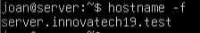                                
| R.INF.02 | Interfície de Xarxa Pública. | NAT (Per accés a Internet i descàrrega de paquets). |
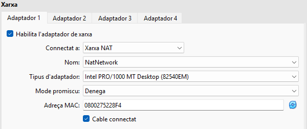 
| R.INF.03 | Interfície de Xarxa Privada. | Host-Only (Per comunicació privada amb el client virtual i la màquina física). |
 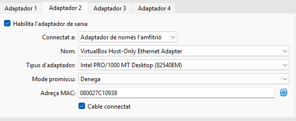

## 3. Tasques d'Implementació i Configuració del Servidor LDAP

### 3.1 Instal·lació i Configuració Base d'OpenLDAP

| ID | Descripció de la Tasca | Detalls de la Configuració |
|----|-------------------------|-----------------------------|
| T.LDAP.01 | Instal·lació del servei OpenLDAP. | Mostrar el resultat de la comanda `slapcat` per validar la instal·lació base. |
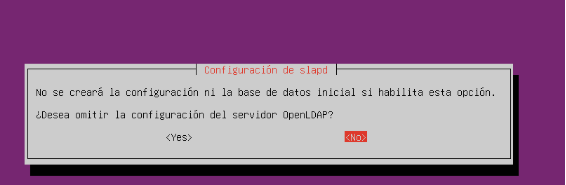
| T.LDAP.02 | Configuració de la base de dades. | Nom del Domini: `innovatechXX.test` Contrasenya: `p@ssw0rd` |
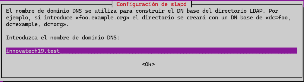
| T.LDAP.03 | Configuració de la contrasenya d’administrador. | Contrasenya: `p@ssw0rd`. Acceptar l’eliminació de la base de dades existent i fer un backup automàtic. |

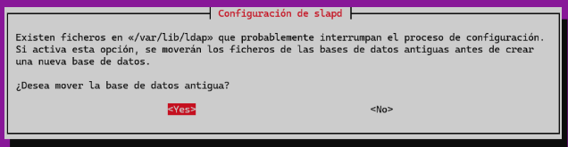
| T.LDAP.4 | Creació d’Unitats Organitzatives (OU) inicials. | Crear dues OUs: `users` i `groups` mitjançant un fitxer `.ldif`. |
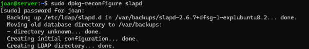
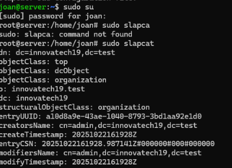
| T.LDAP.05 | Validació de les Unitats Organitzatives. | Executar `ldapsearch -xLLL -b "dc=innovatechXX,dc=test"` per comprovar les OUs creades. |
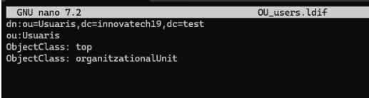
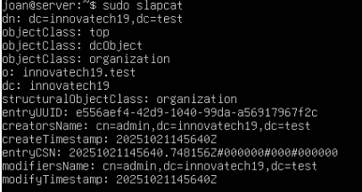
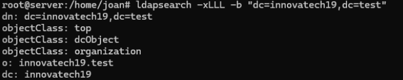

### 3.2 Gestió i Administració (LAM)

| ID | Descripció de la Tasca | Detalls de la Configuració |
|----|-------------------------|-----------------------------|
| T.LAM.01 | Instal·lació del Gestor d'Usuaris LDAP (LAM). | Executar `sudo apt install ldap-account-manager -y`. Accedir via navegador a `https://192.168.56.101/lam`. |

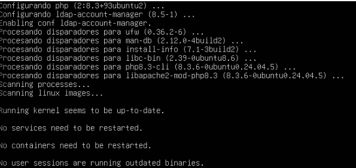

| T.LAM.02 | Accés Remot i Configuració. | Accedir des de la màquina física mitjançant la IP Host-Only. Configuració inicial amb contrasenya `lam`. |

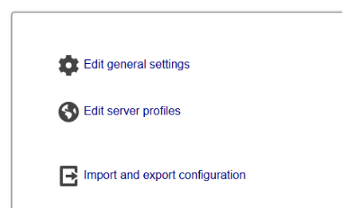
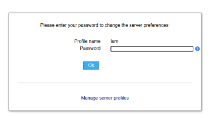
| T.LAM.03 | Configuració per defecte. | Definir OUs per defecte: `users` i `groups`. Modificar els camps `LDAP suffix` a les seccions corresponents i desar els canvis. |
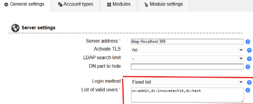

| T.LAM.04 | Creació de Grups. | Crear dos grups de seguretat: `tech` i `manager`. |
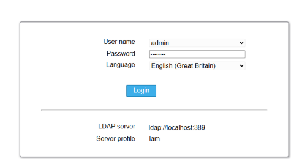
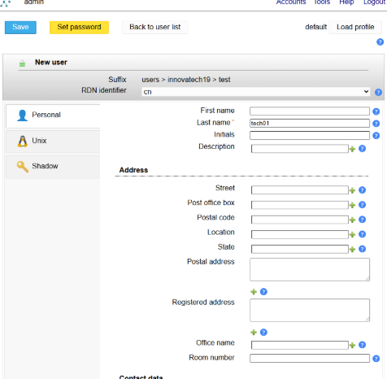
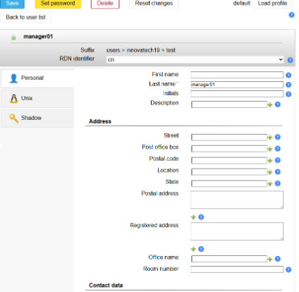
| T.LAM.05 | Creació d'Usuaris de Prova. | Crear usuaris `tech01` (membre de `tech`) i `manager01` (membre de `manager`). |
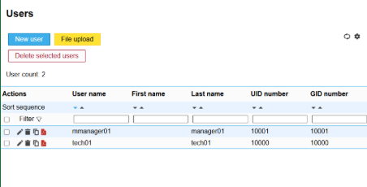

## 4. Integració de Client (Ubuntu Desktop)

| ID | Descripció de la Tasca | Detalls de la Configuració |
|----|-------------------------|-----------------------------|
| T.CLI.01 | Instal·lació del Client. | Instal·lar Ubuntu Desktop i configurar interfície Host-Only. |  
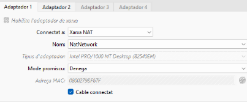                             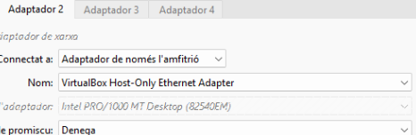
| T.CLI.02 | Resolució de Noms. | Afegir al fitxer `/etc/hosts` la IP del servidor associada a `server.innovatechXX.test`. |

| T.CLI.03 | Validació de la Connectivitat LDAP. | Provar connexió amb `ldapsearch` des del client. |
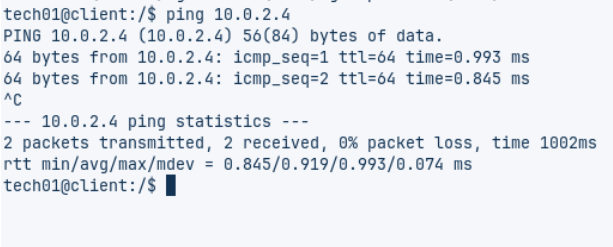
| T.CLI.04 | Mòduls d'Autenticació. | Instal·lar els mòduls necessaris per a l’autenticació LDAP. |
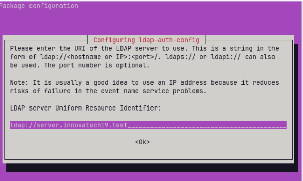
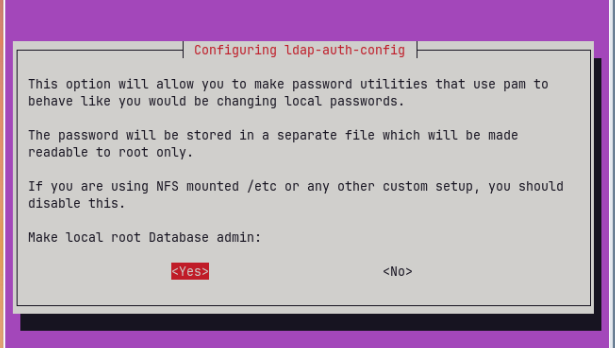
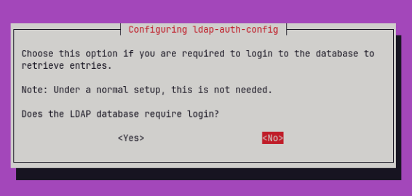

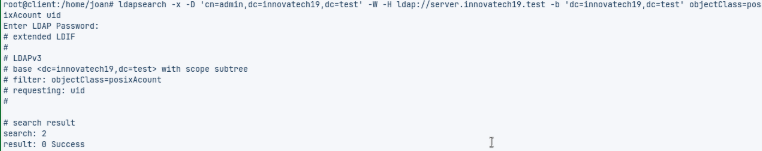
| T.CLI.05 | Configuració del Client. | Modificar els arxius de configuració i documentar els canvis realitzats. |

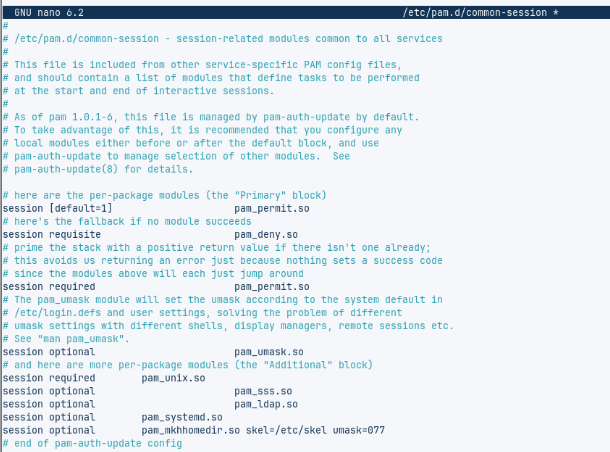

| T.CLI.06 | Comprovació del Sistema. | Executar `getent passwd` per verificar usuaris LDAP visibles localment. |
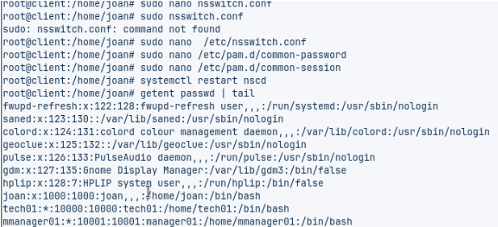
| T.CLI.07 | Prova d'Accés Final. | Reiniciar i iniciar sessió amb `tech01`. Verificar creació automàtica de la carpeta personal. |

