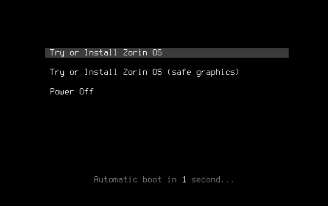
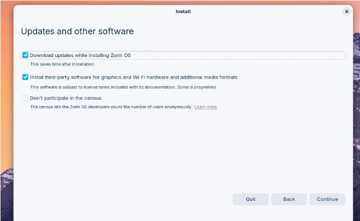
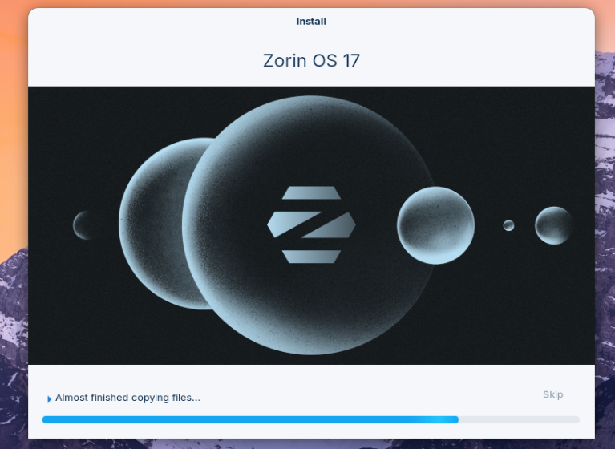
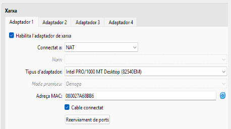
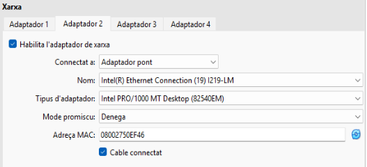
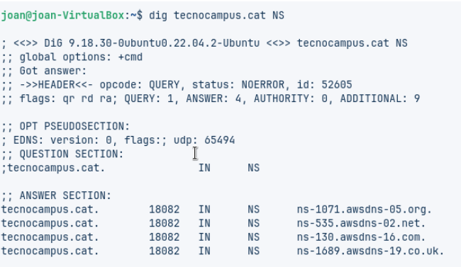
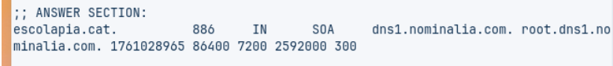
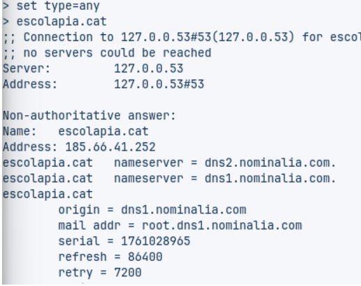

# 🧩 Fase Pràctica: Diagnosi de Noms (Auditoria amb CLI)

## 🔹 Pas 1: Instal·lació de la màquina virtual

Primer de tot, hem d’instal·lar una **màquina Zorin OS** al nostre **VirtualBox**.

Ara hem de fer la instal·lació del sistema operatiu i, un cop la tinguem feta, hem de començar amb la tasca.

Un cop hem acabat de configurar la instal·lació, hem de començar amb la pràctica.

###  Configuració inicial de la màquina virtual

Primer de tot, hem de configurar la nostra màquina virtual.  
L’exercici demana que configurem dos adaptadors de xarxa:

- **Adaptador 1:** NAT  
- **Adaptador 2:** Adaptador pont  

                   

###  Execució de comandes a la terminal

Primer de tot, hem d’**obrir la terminal** i introduir els **comandaments indicats a la pràctica**.

####  Comanda 1: Consulta Bàsica de Registre A

Primer de tot hem d’obrir la terminal de la MV i hem de ficar els comandaments que fiquen a la pràctica.

Comanda 1: Consulta Bàsica de Registre A  
Executa dig xtec.cat A  
Anàlisi: Identifica la IP de resposta, el valor TTL i el servidor que ha respost a la consulta.

ANÀLISI REGISTRE 1:  
La IP és **83.247.151.214** i el valor **TTL és 719**.

#### Comanda 2: Consultes autoritatives  
Escriure server IP i escriure la IP del primer servidor de noms del domini tecnocampus.cat que s’ha obtingut d’una consulta anterior. A continuació, indiqueu que voleu consultar registres de tipus A i del domini tecnocampus.cat  
Anàlisi: Quines diferències s’observen a la resposta obtinguda amb la comanda 1?

## ANÀLISI COMANDA 2

La principal diferència és que els registres **NS** indica quins servidors tenen autoritat sobre el domini i a diferència el **TTL** indica el temps de resposta que el DNS tarda en guardar-ho en cachè.

## Comanda 3: Consulta Detallada SOA

Executa `dig escolapia.cat SOA`  
**Anàlisi:** Quina és la informació del correu de l'administrador i el número de sèrie del domini?

## ANÀLISI COMANDA 3

La informació del correu electrònic del administrador: `root.dns1.nominalia.com`  
I el seu número de sèrie és: `1761028965 86400 7200 2592000 300`

També es pot fer d’una manera més efectiva la qual  surt tota la informació del domini.

