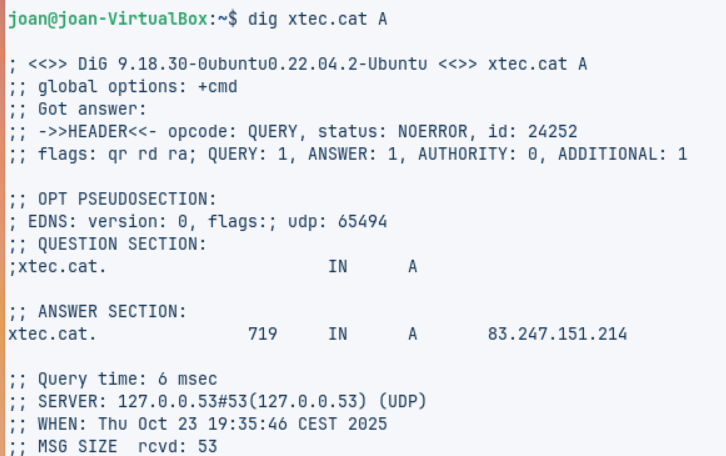

# 🧩 Fase Pràctica: Diagnosi de Noms (Auditoria amb CLI)

## 🔹 Pas 1: Instal·lació de la màquina virtual

Primer de tot, hem d’instal·lar una **màquina Zorin OS** al nostre **VirtualBox**.

Ara hem de fer la instal·lació del sistema operatiu i, un cop la tinguem feta, hem de començar amb la tasca.

Un cop hem acabat de configurar la instal·lació, hem de començar amb la pràctica.

###  Configuració inicial de la màquina virtual

Primer de tot, hem de configurar la nostra màquina virtual.  
L’exercici demana que configurem dos adaptadors de xarxa:

- **Adaptador 1:** NAT  
- **Adaptador 2:** Adaptador pont  

                   

### 💻 Execució de comandes a la terminal

Primer de tot, hem d’**obrir la terminal** i introduir els **comandaments indicats a la pràctica**.

####  Comanda 1: Consulta Bàsica de Registre A

Primer de tot hem d’obrir la terminal de la MV i hem de ficar els comandaments que fiquen a la pràctica.

Comanda 1: Consulta Bàsica de Registre A  
Executa dig xtec.cat A  
Anàlisi: Identifica la IP de resposta, el valor TTL i el servidor que ha respost a la consulta.

ANÀLISI REGISTRE 1:  
La IP és **83.247.151.214** i el valor **TTL és 719**.

